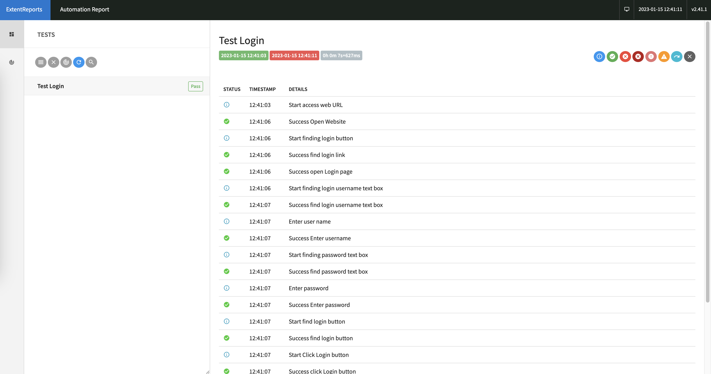
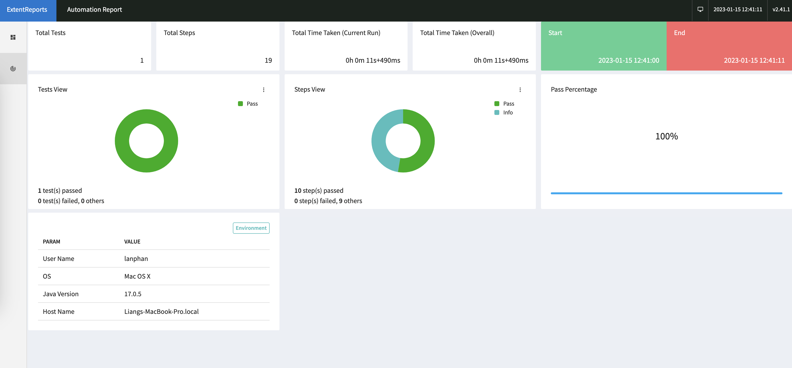

# SeleniumAutoTest
Based on chromedriver auto test webui

## Step.1 download chromedriver
Access below URL and download the chromedriver version according to your local Google Chrome browser version
### 1.1 how to check Google Chrome version
Click [Chrome Version](chrome://version) or enter "chrome://version" in your Google Chrome address bar
Sample Google Chrome Version

### 1.2 download chromedriver via below URL. 
*Do remember download the right version according to your browser version *
[ChromeDriverDownload](https://chromedriver.chromium.org/downloads)


## Step.2 - (Optional Step) initial java test project. Here I used spring boot initializr to initial a java project based on gradle
### 2.1 Access [Springboot initializr](https://start.spring.io/)
### 2.2 Select the option as below:
*Note: in here we only choose spring DevTools dependency* 


## Step.3
### 3.1 Import the project in IntelliJ IDEA as gradle project
### 3.2 Update build.gradle as below
**Here we remove springboot dependencies as we only testing via selenium**
```groovy
plugins {
	id 'java'
//	id 'org.springframework.boot' version '3.0.1'
//	id 'io.spring.dependency-management' version '1.1.0'
}

group = 'com.lfa'
version = '0.0.1-SNAPSHOT'
sourceCompatibility = '17'

repositories {
	mavenCentral()
}

dependencies {
//	implementation 'org.springframework.boot:spring-boot-starter'
//	developmentOnly 'org.springframework.boot:spring-boot-devtools'
//	testImplementation 'org.springframework.boot:spring-boot-starter-test'
	testImplementation 'org.springframework.boot:spring-boot-starter-log4j2:2.7.7'
    //remove springboot test but we required Junit here
	testImplementation 'org.junit.jupiter:junit-jupiter:5.9.1'
    // import selenium-java
	testImplementation 'org.seleniumhq.selenium:selenium-java:4.7.2'
    // extentreports will be used to generate selenium html report
	testImplementation 'com.relevantcodes:extentreports:2.41.2'
	compileOnly 'org.projectlombok:lombok:1.18.24'
	annotationProcessor 'org.projectlombok:lombok:1.18.24'
	testCompileOnly 'org.projectlombok:lombok:1.18.24'
	testAnnotationProcessor 'org.projectlombok:lombok:1.18.24'

}

tasks.named('test') {
	useJUnitPlatform()
}
```
### 3.3 Create BaseTest class to have basic control on web driver & selenium report 
```java
    /***
     * initial test report
     */
    @BeforeAll
    public static void startTestReport(){
        seleniumReports = new ExtentReports(EXTENT_REPORT_PATH);
    }

    /**
     * Initial webdriver with system properties
     * define window size
     */
    @BeforeEach
    public void initialWebDriver(){
        System.setProperty("webdriver.chrome.driver", CHROME_DRIVER_PATH);
        System.setProperty("webdriver.chrome.logfile", CHROME_LOG_PATH);
        System.setProperty("webdriver.chrome.verboselogging", "true");
        webDriver = new ChromeDriver();
        webDriver.manage().window().setSize(new Dimension(1200, 1024));
        webDriverWait = new WebDriverWait(webDriver, Duration.ofSeconds(3));
    }

    /**
     * close webdriver after each test case
     */
    @AfterEach
    public void stopWebDriver(){
        // if only single testing, we can use webDriver.quit()
        // webDriver.quit();
        webDriver.close();
    }

    /**
     * Close test report and write to disk
     */
    @AfterAll
    public static void closeTestReport(){
        seleniumReports.flush();
        seleniumReports.close();
    }
```
### 3.4 extend BaseTest and create our first selenium test case - Login
**- Note: Create test case under ExtentReport when test start**
**- Note: Better log down every steps/actions**
```java
    @Test
    public void testLogin(){
        ExtentTest test = seleniumReports.startTest("Test Login");
        test.log(LogStatus.INFO, "Start access web URL");
        webDriver.get(URL);
        test.log(LogStatus.PASS, "Success Open Website");

        test.log(LogStatus.INFO, "Start finding login button");
        WebElement loginLink = webDriverWait.until(ExpectedConditions.presenceOfElementLocated(By.id("tl-cms-nav-login")));
        assertNotNull(loginLink);
        test.log(LogStatus.PASS, "Success find login link");
        loginLink.click();
        test.log(LogStatus.PASS, "Success open Login page");

        //to start xpath https://www.w3schools.com/xml/xpath_intro.asp
        test.log(LogStatus.INFO, "Start finding login username text box");
        WebElement loginUserName = webDriverWait.until(ExpectedConditions.visibilityOfElementLocated(By.xpath("//input[@id=\"tl-shared-username\"]")));
        assertNotNull(loginUserName);
        test.log(LogStatus.PASS, "Success find login username text box");
        test.log(LogStatus.INFO, "Enter user name");
        loginUserName.sendKeys(USER_NAME);
        test.log(LogStatus.PASS, "Success Enter username");

        test.log(LogStatus.INFO, "Start finding password text box");
        WebElement loginPassword = webDriverWait.until(ExpectedConditions.visibilityOfElementLocated(By.name("password")));
        assertNotNull(loginPassword);
        test.log(LogStatus.PASS, "Success find password text box");
        test.log(LogStatus.INFO, "Enter password");
        loginPassword.sendKeys(PASS_CREDENTIAL);
        test.log(LogStatus.PASS, "Success Enter password");

        test.log(LogStatus.INFO, "Start find login button");
        WebElement loginSubmit = webDriverWait.until(ExpectedConditions.visibilityOfElementLocated(By.name("submit")));
        assertNotNull(loginSubmit);
        test.log(LogStatus.PASS, "Success find login button");
        test.log(LogStatus.INFO, "Start Click Login button");
        loginSubmit.click();
        test.log(LogStatus.PASS, "Success click Login button");

        test.log(LogStatus.INFO, "Validate Success Login URL: "+URL_SUCCESS_LOGIN);
        assertTrue(webDriverWait.until(ExpectedConditions.urlMatches(URL_SUCCESS_LOGIN)));
        test.log(LogStatus.PASS, "Success Login URL matched");

        seleniumReports.endTest(test);

    }
```

### 3.5 after success test and verify test report


