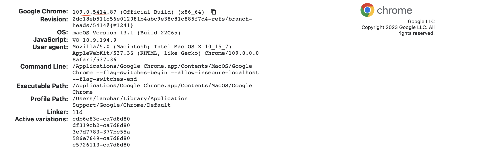

# SeleniumAutoTest
Based on chromedriver auto test webui

## Step.1 download chromedriver
Access below URL and download the chromedriver version according to your local Google Chrome browser version
### 1.1 how to check Google Chrome version
Click [Chrome Version](chrome://version) or enter "chrome://version" in your Google Chrome address bar
Sample Google Chrome Version

### 2.2 download chromedriver via below URL. 
*Do remember download the right version according to your browser version *
[ChromeDriverDownload](https://chromedriver.chromium.org/downloads)

## Step.2 initial java test project. Here I used spring boot initializr to initial a java project based on gradle
### 2.1 Access [Springboot initializr](https://start.spring.io/)
### 2.2 Select the option as below:
* Note: in here we only choose spring DevTools dependency 

